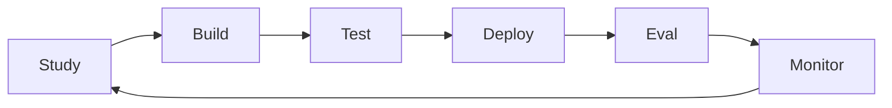

# Study-Build-Test-Deploy-Eval-Monitor Lifecycle

## The Weekly Rhythm

Every phase below runs this same six-stage loop. A phase is not done after one pass through it - you loop until the exit criteria in the phase table are met, sometimes twice in a week.

**Weekday reading (4 hrs, Mon-Fri, 20 hrs/week):** short, frequent loops. A weekday is one Study block (45-60 min, docs or an Academy course video) followed by one Build block (2-2.5 hrs, porting a single file or writing one node) and one Test block (30-45 min, running the ported piece against an existing IEM-PM fixture). Deploy/Eval/Monitor mostly wait for the weekend, except a quick local `langgraph dev` smoke check before you stop for the day.

**Weekend reading (6 hrs, Sat-Sun, 12 hrs/week):** long, integrative loops. This is where Deploy (push the week's nodes to a local LangGraph Studio session or a staging Deployment), Eval (run the LangSmith Evaluation dataset for what you built), and Monitor (read the traces Observability captured) actually happen. Close each weekend with a Study block: read what the traces and eval failures are telling you, and write down what next week's Build should fix before it starts.

This means every phase spans a whole number of weeks - you never half-finish a loop mid-week and carry it over ungracefully; the weekend always closes the loop the weekdays opened.

## Master Phase Table

15 weeks total at 32 hrs/week (about 480 hours) covers every product in the ecosystem at real depth, not a tour.

| Phase | Weeks | Ecosystem focus | Study source | Build target | Exit criteria |
| --- | --- | --- | --- | --- | --- |
| 0. Foundations | 1 | langchain, Pydantic | LangChain Academy: Intro to LangChain (Python) | Dev environment, a Pydantic model for one Contract | You can explain create\_agent, tool calling, and a Pydantic schema without looking it up |
| 1. State & Contracts | 1 | langchain, Pydantic | LangGraph docs: state and schemas | Full State schema for all 5 Contracts, validated against findings.schema.json | State schema round-trips the existing test\_findings.json fixture with no errors |
| 2. Graph skeleton | 2 | langgraph | LangChain Academy: Intro to LangGraph | All 11 stages as stub nodes, conditional edges from audit-stages.md Decision Logic, interrupt() at Charter and Human-Approval gates | The stubbed graph runs Stage 0 through Stage 10 end to end with mocked LLM calls and pauses correctly at both interrupts |
| 3. Deep Agents + Measure | 2 | deepagents | LangChain Academy: Foundation - Deep Agents | Stage 3 Measure as a real Deep Agents node with per-artifact subagents; registry-deriver subagent for Stage 2 | Stage 3 reproduces test\_manifest.md's 2 findings from the same fixture evidence |
| 4. Remaining judgment stages | 2 | langgraph, deepagents | docs.langchain.com structured output guide | Stages 4-7 (Classify, Trace, Score, Synthesize) with structured-output emission replacing manifest\_to\_findings.py | The graph emits canonical JSON directly; schema-conformance passes with zero regex parsing anywhere |
| 5. Observability + Evaluation | 1.5 | LangSmith Observability, Evaluation | LangSmith Academy: foundational Evals course | Tracing wired in; gap\_classification\_dataset and root\_origin\_dataset built from the taxonomy disambiguation tables | A full audit run is traceable stage by stage; the offline eval suite passes at a baseline score you record |
| 6. Sandboxes | 1 | LangSmith Sandboxes | Sandboxes docs + the two-patterns blog post | Stage 0 and Stage 3 evidence parsing moved into a Sandbox image | A deliberately malformed PDF/xlsx fails safely inside the Sandbox without touching the orchestration host |
| 7. LLM Gateway | 0.5 | LangSmith LLM Gateway | LLM Gateway docs | All model calls routed through the Gateway; skill\_version/model provenance logged automatically | You can answer "which model produced finding X" from Gateway logs alone, no header parsing |
| 8. Deployment go-live | 1.5 | LangSmith Deployment | Deployment/application-structure docs | langgraph.json finalized; first tenant onboarded on audit.korvai.app staging | A real Charter ratification pauses and resumes correctly across a Deployment restart |
| 9. Engine | 0.5 setup, then ongoing | LangSmith Engine | Engine docs + Interrupt 26 talk | Engine watching production traces from the staging tenant | Engine surfaces one real clustered failure and proposes a fix you can review |
| 10. Fleet + Context Hub | 1.5 | LangSmith Fleet, Context Hub | Fleet and Context Hub docs | Onboarding template for non-technical PMs; skill/reference files under Context Hub version control | A PMO lead with no Claude Code experience completes one audit through Fleet alone |

## Phases 0-2 in Detail

These three phases teach the loop at day-level granularity. Once the rhythm is automatic, Phases 3 onward compress to week-level detail.

### Phase 0 - Foundations (Week 1)

| Day | Study (weekday AM) | Build/Test (weekday PM) |
| --- | --- | --- |
| Mon | LangChain Academy: Intro to LangChain, modules 1-2 | Set up venv, install langchain/langgraph/deepagents, create a LangSmith account and API key |
| Tue | Modules 3-4: tool calling, create\_agent | Write a throwaway single-tool agent (anything - a calculator tool is fine) |
| Wed | Module 5: middleware | Add one middleware to that agent (a logging or redaction hook) |
| Thu | Pydantic v2 docs: models, validators | Rewrite the toy agent's tool input/output as Pydantic models instead of dicts |
| Fri | Skim findings.schema.json again with fresh eyes | List every field you do not yet understand - this list drives Monday of Phase 1 |

**Sat (6h):** Build a second toy agent that calls two tools in sequence. Test it by hand with three inputs. **Sun (6h):** Deploy the toy agent locally and open LangSmith - look at your first real trace. Study what a span, a run, and a trace actually are before Phase 1 needs that vocabulary.

### Phase 1 - State & Contracts (Week 2)

| Day | Build |
| --- | --- |
| Mon | Draft the Standards and Charter Contract fields as Pydantic models |
| Tue | Draft the Audit Manifest and Canonical Findings Contract fields |
| Wed | Encode the 7 gap types and 7 root origins as Python Literal or Enum types - this is where the closed-taxonomy rule becomes a type, not a prompt |
| Thu | Test: load IEM-PM's real test\_findings.json into your model; fix every field mismatch |
| Fri | Test: write one pytest asserting your model round-trips that fixture with no data loss |

**Sat (6h):** Finish the full State schema. Eval by hand: diff your schema's serialized JSON against findings.schema.json, field by field, and note every deliberate difference. **Sun (6h):** Study what changed and why (mainly: fields that existed only to support manifest\_to\_findings.py's regex parsing no longer need to exist). Write a one-page decision log - you will want it in Phase 4 when Synthesize replaces that parser.

### Phase 2 - Graph Skeleton (Weeks 3-4)

**Week 3 - Stages 0 through 5, stubbed:**

| Day | Focus |
| --- | --- |
| Mon | Study StateGraph/nodes/edges; build Stage 0 and Stage 1 as stub nodes returning fixed state |
| Tue | Study interrupt(); wire Stage 1's Charter propose/ratify/edit/decline branches from audit-stages.md's Decision Logic |
| Wed | Stub Stage 2; test the Stage 0 to 1 to 2 routing with a fake ratified Charter |
| Thu | Stub Stage 3 |
| Fri | Stub Stages 4 and 5; run the partial graph with `langgraph dev`, confirm state flows through all five |

**Sat (6h):** Wire every Halt Condition from SKILL.md section 6.6 as a terminal edge; trigger each one deliberately and confirm the graph stops where it should. **Sun (6h):** Deploy the Stage 0-5 skeleton in LangGraph Studio and watch it run visually. Study any stage whose Decision Logic did not translate cleanly into an edge condition - that friction is real signal, not a mistake.

**Week 4 - Stages 6 through 10, then integration:**

| Day | Focus |
| --- | --- |
| Mon | Stage 6 with its own interrupt() for the Severity 4/5 Human Approval gate |
| Tue | Stage 7 - the chain-verification check becomes a validation edge that raises CHAIN\_INTEGRITY\_LOST |
| Wed | Stages 8 and 9 as deterministic stub nodes - no LLM call, plain Python |
| Thu | Stage 10 terminal node; run the complete stub graph end to end |
| Fri | Test: confirm both interrupts fire correctly on the full 11-stage path |

**Sat (6h):** Replace the mocked LLM calls on two or three stages with real prompts against a tiny synthetic evidence set. **Sun (6h):** Deploy to Studio; Eval by comparing output shape to test\_findings.json; Study and close out Phase 2 with a written note of what is still stubbed versus real before Phase 3 begins.

## Phases 3-6

The loop is now automatic, so these move to week-level detail. Keep applying the same weekday-build / weekend-deploy-eval-monitor split from the rhythm above.

### Phase 3 - Deep Agents + Measure (Weeks 5-6)

| Week | Study | Build | Test |
| --- | --- | --- | --- |
| 5 | LangChain Academy: Deep Agents foundation course - planning tools, subagent isolation | Convert Stage 3 Measure into a Deep Agents node; write the evidence\_reader tool with column-index-safe reading (this ports the real Stage 3 bug fix from Activity 1) | Run against the ART-001/002/003 fixture in test\_manifest.md |
| 6 | Subagent delegation patterns | Per-artifact subagent delegation for parallel, isolated-context evidence reads; a registry-deriver subagent for Stage 2's on-demand deep-dive | Stage 3 reproduces both findings from the same fixture, weekend Deploy in Studio, Monitor the subagent call traces |

### Phase 4 - Remaining Judgment Stages (Weeks 7-8)

| Week | Build | Test |
| --- | --- | --- |
| 7 | Stage 4 Classify and Stage 5 Trace, each loading gap-taxonomy.md and root-origins.md as Deep Agents skills rather than pasted context | Classify and trace the fixture's two findings; confirm the closed-taxonomy Pydantic types reject an invalid gap type or origin |
| 8 | Stage 6 Score (severity-matrix.md becomes a plain deterministic lookup, not agent-read) and Stage 7 Synthesize, which emits the Canonical Findings JSON directly as structured output | Full pipeline reproduces test\_findings.json's Reporting Integrity Score with manifest\_to\_findings.py fully retired |

### Phase 5 - Observability + Evaluation (Weeks 9-10, first half)

- Wire LangSmith tracing across the whole graph.
- Build two eval datasets straight from the taxonomy files: gap-taxonomy.md's Master Disambiguation table and root-origins.md's Master Disambiguation table each give you seven gold-labeled examples to start with.
- Build a pipeline\_regression dataset from test\_manifest.md, test\_findings.json, and test\_scope\_limitation\_notice.md.
- Write three evaluators: schema\_conformance (code), no\_duplicate\_finding (code), and a terminology\_discipline\_judge (LLM-as-judge, checking free-text narrative against terminology.md's controlled vocabulary rule).
- Weekend: run your first eval experiment and record the baseline score - every later change gets compared against this number.

### Phase 6 - Sandboxes (Weeks 10-11, second half)

- Study Sandboxes' microVM isolation and Auth Proxy.
- Move baseline.py's PDF parsing and Stage 3's evidence reading into a Sandbox image built from the pypdf/openpyxl/cryptography dependencies.
- Test with a deliberately malformed PDF and a corrupted xlsx - confirm the failure is contained inside the Sandbox and never reaches the orchestration host.
- Weekend: deploy the sandboxed nodes and monitor sandbox startup latency and lifecycle behavior under repeated runs.

## Phases 7-10

### Phase 7 - LLM Gateway (half of Week 12)

Study the Gateway docs, then route every model call in the graph through it instead of a direct provider client. Set a spend cap and rate limit for the whole project. Test by asking a genuinely useful question of your own logs: which model produced finding X, on which skill version - if Gateway logs answer that without opening a single Manifest file, the phase is done.

### Phase 8 - Deployment Go-Live (Weeks 12-13, second half of 12 through 13)

Finalize langgraph.json against the real application-structure convention. Deploy to a staging environment and onboard one real or realistic tenant. The test that actually matters here: start a Charter ratification, force a Deployment restart mid-wait, and confirm the interrupt resumes cleanly on the human's eventual ratification. If that survives a restart, durable execution is doing its job and audit.korvai.app can safely hold a paused audit for days.

### Phase 9 - Engine (half of Week 14, then ongoing)

Turn Engine on against the staging tenant's real traces. This phase does not finish on a calendar - it finishes when Engine has enough production traffic to cluster a real failure and propose a fix you can review and accept or reject. Budget the half week for setup and onboarding your judgment to how Engine's proposals read; treat everything after that as a standing five-minutes-a-day review habit, not a project task.

### Phase 10 - Fleet + Context Hub (Weeks 14-15)

Build a Fleet onboarding template that replaces setup.bat, setup.sh, setup.ps1, and setup\_gui.pyw with a template-plus-connected-accounts flow. Move SKILL.md and the reference files into Context Hub so they carry real version history and a review step before promotion. The exit test is the sharpest one in the whole plan: hand the product to a PMO lead who has never seen Claude Code, and watch them complete one full audit through Fleet alone, with no prompt typed by hand.

## The Weekly Check-In

End every Sunday with three questions, in this order:

1. **Did this week's Test or Eval actually pass against a real IEM-PM fixture** - not "it ran without an error," but the specific fixture the phase table names for that week. If it did not, the phase is not done, no matter how much was built.
2. **What did Monitor show that Study did not predict?** A trace or eval failure that surprises you is the most valuable thing that happened all week - write it down before it fades, it is next week's first Study block.
3. **Is next week's Build still the one the phase table names, or did this week's Monitor step change it?** The plan is a starting sequence, not a contract - if Stage 3's evidence reading breaks in a way Phase 4 depends on, fix it before moving forward rather than building Classify on top of a Measure you already know is wrong.

**If a week runs over:** protect the Test step before the Build step. An extra half-day spent finishing a build with no test against it is worse than a smaller build that is actually verified against the real fixture - a phase that looks done but was never checked against test\_manifest.md or test\_findings.json will cost far more time later, once three more phases have been built on top of it.
